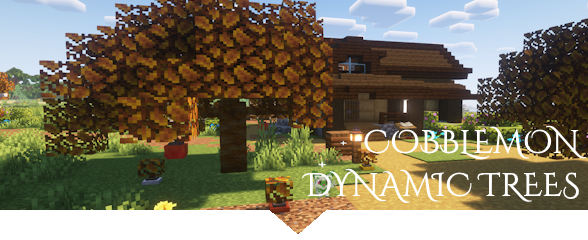

**Compatibility: [Cobblemon](https://cobblemon.com/en) (1.6.1) & [Dynamic Trees](https://modrinth.com/mod/dynamictrees) for Minecraft 1.21.1 (NeoForge)
Recommended: install [Jade](https://modrinth.com/mod/jade) for extra info in-game.**

* Apricorn trees fully integrate with Dynamic Trees growth mechanics.
* Occasionally, ripe apricorns may fall off branches on their own — or you can knock them down with a projectile.
* Saplings can be obtained in two ways: by breaking unripe apricorns, or waiting for the tree to drop a seed naturally from its canopy.
* Apricorn color depends on the biome:

1. Black and Yellow apricorns tend to grow in sparse or open woodlands.
2. Red and Blue varieties prefer moderately dense forests.
3. Pink, Green, and more Yellow are common in thick, overgrown biomes.

**Совместимость [Cobblemon](https://cobblemon.com/en) (1.6.1) и [Dynamic Trees](https://modrinth.com/mod/dynamictrees) для Minecraft 1.21.1 (NeoForge). Рекомендую использовать также [Jade](https://modrinth.com/mod/jade)**

* Априкорновые деревья используют механику роста Dynamic Trees.
* Иногда априкорны - растущие на деревьях могут упасть с ветки. (также их можно сбить снарядом)
* Росток можно получить двумя способами: разбив недозревший априкорн или дождавшись, пока дерево случайно уронит семечко с листвы.
* Цвет априкорнов зависит от биома:

1. Чёрные и жёлтые — встречаются в редколесьях и других слабо-лесистых биомах.
2. Красные и синие — предпочитают умеренно-плотные леса.
3. Розовые, зелёные и жёлтые — растут в густых, заросших биомах

### В планах:
Saccharine Tree из Cobblemon 1.7.0
